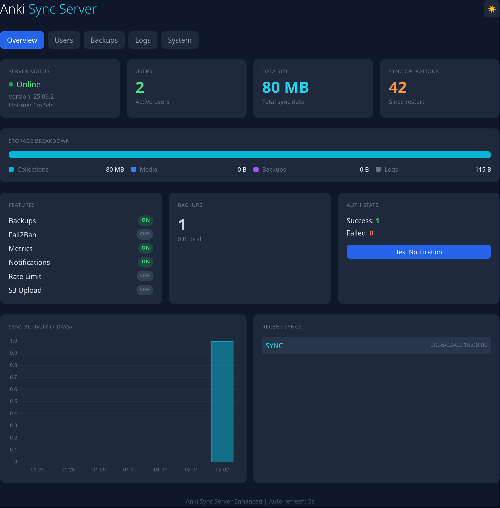

# Anki Sync Server Enhanced

[](https://hub.docker.com/r/chrislongros/anki-sync-server-enhanced)
[](https://github.com/chrislongros/anki-sync-server-enhanced/actions)
[](https://ghcr.io/chrislongros/anki-sync-server-enhanced)
[](https://github.com/ankitects/anki/releases)

Production-ready Docker image for self-hosted Anki sync server with backups, monitoring, dashboard, and security features.

## Why This Image?

The official Anki project provides sync server source code but no pre-built Docker images. This project provides:

- **Zero build time** - Pre-compiled for amd64, arm64, and arm/v7
- **Auto-updates** - Daily builds automatically track the latest Anki release
- **Enterprise features** - Backups, monitoring, alerts, and security out of the box
- **NAS-ready** - Works on TrueNAS SCALE, Unraid, Synology, and any Docker host

## Features

| Feature | This Image |
|---------|------------|
| Pre-built Docker image | ✅ |
| Auto-updates (daily builds) | ✅ |
| Multi-arch (amd64, arm64, arm/v7) | ✅ |
| Automated backups with retention | ✅ |
| S3/MinIO backup upload | ✅ |
| Prometheus metrics | ✅ |
| Web dashboard | ✅ |
| Discord/Telegram/Slack/Email alerts | ✅ |
| Docker secrets support | ✅ |
| Hashed passwords | ✅ |
| Fail2ban integration | ✅ |
| Rate limiting | ✅ |
| User management CLI | ✅ |
| PUID/PGID support | ✅ |

## Quick Start

```bash
docker run -d \
  --name anki-sync \
  -p 8080:8080 \
  -e SYNC_USER1=user:password \
  -v anki_data:/data \
  chrislongros/anki-sync-server-enhanced
```

Then configure your Anki client to sync to `http://your-server:8080/`

## Docker Compose

```yaml
services:
  anki-sync-server:
    image: chrislongros/anki-sync-server-enhanced:latest
    container_name: anki-sync
    ports:
      - "8080:8080"   # Sync server
      - "8081:8081"   # Dashboard (optional)
      - "9090:9090"   # Metrics (optional)
    environment:
      - SYNC_USER1=alice:password1
      - SYNC_USER2=bob:password2
      - TZ=Europe/Berlin
      - BACKUP_ENABLED=true
      - METRICS_ENABLED=true
      - DASHBOARD_ENABLED=true
    volumes:
      - anki_data:/data
      - anki_backups:/backups
    restart: unless-stopped

volumes:
  anki_data:
  anki_backups:
```

## Web Dashboard

Enable with `DASHBOARD_ENABLED=true` and access at `http://server:8081/`

**Features:**
- **Overview** - Server status, uptime, user count, data size, sync operations
- **Users** - Per-user statistics with data size and last sync time
- **Backups** - List backups, create new backups with one click
- **Logs** - View sync, auth, and backup logs with color-coded entries
- **System** - Disk usage, memory usage, load average

Protect with basic auth using `DASHBOARD_AUTH=admin:password`

<!-- 
Screenshot placeholder - add actual screenshot

-->

## Configuration Reference

### Core

| Variable | Description | Default |
|----------|-------------|---------|
| `SYNC_USER1`-`SYNC_USER99` | User credentials (user:pass) | Required |
| `SYNC_HOST` | Listen address | `0.0.0.0` |
| `SYNC_PORT` | Listen port | `8080` |
| `LOG_LEVEL` | debug/info/warn/error | `info` |
| `TZ` | Timezone | `UTC` |
| `PUID` / `PGID` | File permissions | `1000` |
| `PASSWORDS_HASHED` | Use hashed passwords | `0` |

### Backups

| Variable | Description | Default |
|----------|-------------|---------|
| `BACKUP_ENABLED` | Enable backups | `false` |
| `BACKUP_SCHEDULE` | Cron schedule | `0 3 * * *` |
| `BACKUP_RETENTION_DAYS` | Keep days | `7` |

### S3 Upload

| Variable | Description | Default |
|----------|-------------|---------|
| `S3_BACKUP_ENABLED` | Upload to S3 | `false` |
| `S3_ENDPOINT` | S3 endpoint (MinIO/Garage) | - |
| `S3_BUCKET` | Bucket name | - |
| `S3_ACCESS_KEY` | Access key | - |
| `S3_SECRET_KEY` | Secret key | - |
| `S3_REGION` | Region | `us-east-1` |

### Monitoring

| Variable | Description | Default |
|----------|-------------|---------|
| `METRICS_ENABLED` | Prometheus metrics | `false` |
| `METRICS_PORT` | Metrics port | `9090` |
| `DASHBOARD_ENABLED` | Web dashboard | `false` |
| `DASHBOARD_PORT` | Dashboard port | `8081` |
| `DASHBOARD_AUTH` | Auth (user:pass) | - |

### Notifications

| Variable | Description | Default |
|----------|-------------|---------|
| `NOTIFY_ENABLED` | Enable webhooks | `false` |
| `NOTIFY_TYPE` | discord/telegram/slack/ntfy | `discord` |
| `NOTIFY_WEBHOOK_URL` | Webhook URL | - |
| `EMAIL_ENABLED` | Enable email | `false` |
| `EMAIL_HOST` | SMTP host | - |
| `EMAIL_PORT` | SMTP port | `587` |
| `EMAIL_USER` / `EMAIL_PASS` | SMTP credentials | - |
| `EMAIL_FROM` / `EMAIL_TO` | Email addresses | - |

### Security

| Variable | Description | Default |
|----------|-------------|---------|
| `FAIL2BAN_ENABLED` | Enable fail2ban | `false` |
| `FAIL2BAN_MAX_RETRIES` | Max failures | `5` |
| `FAIL2BAN_BAN_TIME` | Ban seconds | `3600` |
| `RATE_LIMIT_ENABLED` | Enable rate limit | `false` |
| `RATE_LIMIT_REQUESTS` | Max requests | `100` |
| `RATE_LIMIT_WINDOW` | Window seconds | `60` |

## CLI Tools

```bash
# User management
docker exec anki-sync user-manager.sh list
docker exec anki-sync user-manager.sh add john
docker exec anki-sync user-manager.sh add john mypassword
docker exec anki-sync user-manager.sh reset john newpass
docker exec anki-sync user-manager.sh hash mypassword
docker exec anki-sync user-manager.sh stats

# Backup management
docker exec anki-sync backup.sh
docker exec anki-sync restore.sh --list
docker exec anki-sync restore.sh --list-s3
docker exec anki-sync restore.sh backup_file.tar.gz
docker exec anki-sync restore.sh --s3 backup_file.tar.gz
```

## Client Configuration

### Desktop (Windows/Mac/Linux)

1. Open Anki
2. Go to **Tools → Preferences → Syncing**
3. Set custom sync server to: `http://your-server:8080/`
4. Click **Sync** and enter your credentials

### AnkiDroid (Android)

1. Open AnkiDroid
2. Go to **Settings → Sync → Custom sync server**
3. Set sync URL: `http://your-server:8080/`
4. Set media URL: `http://your-server:8080/msync/`
5. Sync with your credentials

### AnkiMobile (iOS)

1. Open AnkiMobile
2. Go to **Settings → Sync → Custom server**
3. Enter: `http://your-server:8080/`
4. Sync with your credentials

> **Tip:** Use HTTPS with a reverse proxy (Traefik, Caddy, nginx) for secure remote access. See [docker-compose.traefik.yml](docker-compose.traefik.yml) for an example.

## Prometheus Metrics

Available at `http://server:9090/metrics` when `METRICS_ENABLED=true`:

| Metric | Description |
|--------|-------------|
| `anki_sync_users_total` | Configured user count |
| `anki_sync_data_bytes` | Total data size |
| `anki_sync_backup_count` | Number of backups |
| `anki_sync_uptime_seconds` | Server uptime |
| `anki_sync_operations_total` | Total sync operations |
| `anki_auth_success_total` | Successful logins |
| `anki_auth_failed_total` | Failed logins |

## Docker Secrets

For secure credential management:

```yaml
services:
  anki-sync-server:
    image: chrislongros/anki-sync-server-enhanced:latest
    environment:
      - SYNC_USER1_FILE=/run/secrets/anki_user1
    secrets:
      - anki_user1

secrets:
  anki_user1:
    file: ./secrets/user1.txt  # Contains: username:password
```

## Image Sources

| Registry | Image |
|----------|-------|
| Docker Hub | `chrislongros/anki-sync-server-enhanced` |
| GitHub Container Registry | `ghcr.io/chrislongros/anki-sync-server-enhanced` |

## NAS Installation

- **TrueNAS SCALE:** See [truenas/README.md](truenas/README.md)
- **Unraid:** Use [unraid/anki-sync-server.xml](unraid/anki-sync-server.xml)

## Troubleshooting

**Can't connect to server:**
- Ensure port 8080 is exposed and not blocked by firewall
- Check container logs: `docker logs anki-sync`
- Verify the sync URL ends with `/` (e.g., `http://server:8080/`)

**Sync fails with large collections:**
- If using a reverse proxy, increase `client_max_body_size` (nginx) or equivalent
- Set `MAX_SYNC_PAYLOAD_MEGS` environment variable if needed

**Authentication issues:**
- Ensure username doesn't contain special characters
- Check auth log: `docker exec anki-sync cat /var/log/anki/auth.log`
- Try resetting password: `docker exec anki-sync user-manager.sh reset username newpassword`

**Dashboard not loading:**
- Ensure `DASHBOARD_ENABLED=true` is set
- Check port 8081 is exposed
- View logs: `docker logs anki-sync | grep dashboard`

## Building Locally

```bash
# Auto-detect latest Anki version
docker build -t anki-sync-server-enhanced .

# Specify version
docker build --build-arg ANKI_VERSION=25.09.2 -t anki-sync-server-enhanced .
```

## Credits

Built from the official [Anki](https://github.com/ankitects/anki) sync server by Ankitects.

## License

AGPL-3.0 - see [LICENSE](LICENSE)
